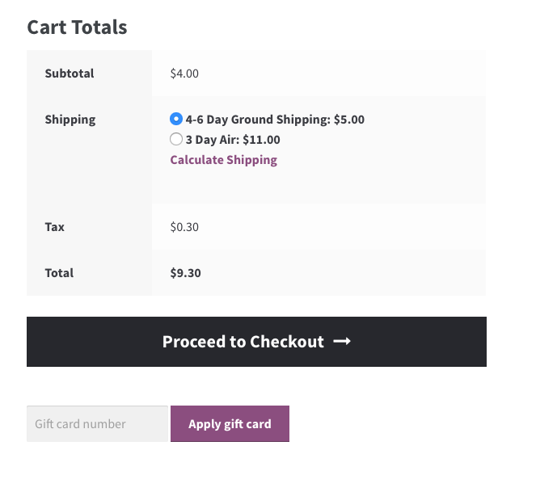
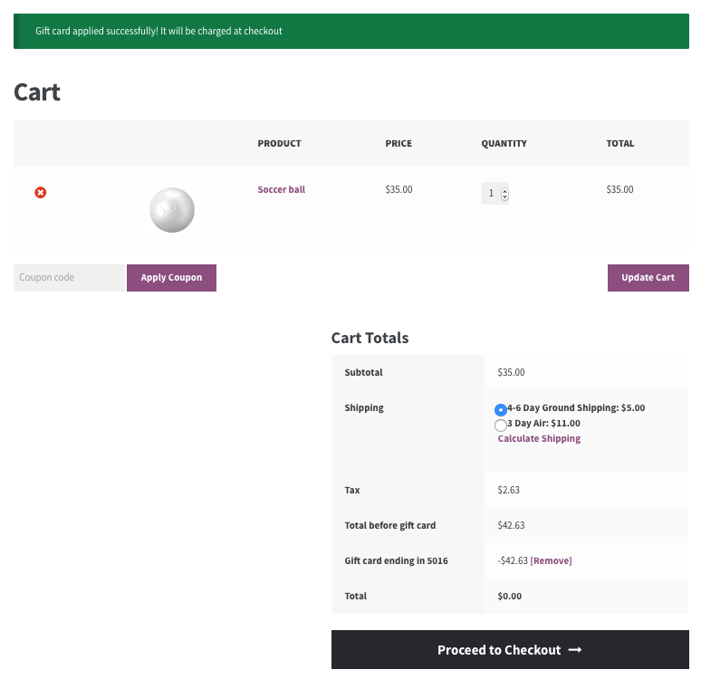
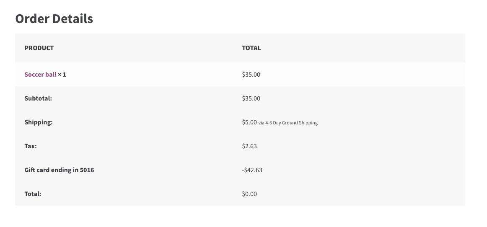
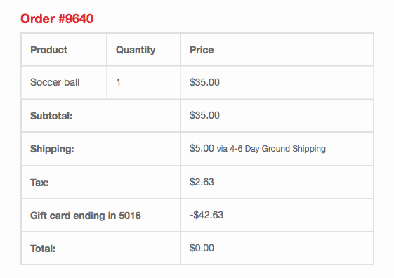
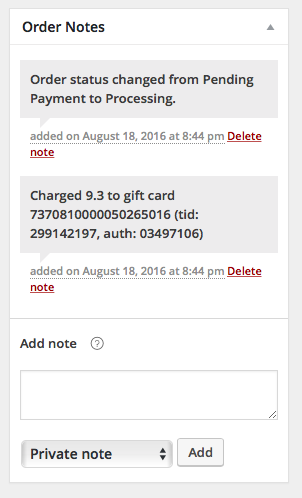
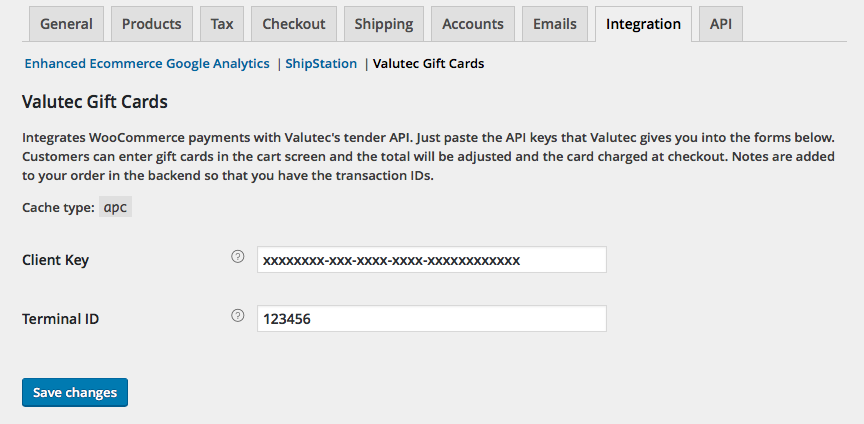

# WooCommerce Valutec Gift Cards

This plugin lets people pay for orders with a gift card from [Valutec](https://www.valutec.net). They can enter one or more cards at the cart screen and it will be deducted from the order and charged after the payment screen. The last four digits of the gift card will show in the order details and receipts.

## Features

There are 3 places this plugin integrates:

A new field is added to the cart where you can add a gift card

The order totals screen and the emailed receipt will show how much was charged to the card

You will see messages on Woocommerce's Order Notes panel with transaction details including card number and transaction ID in case you need to do anything manually.

And all you need to do is enter your API keys!

Other features are:

* Customers can pay with more than one gift card and they'll be charged in order
* Uses caching when available to minimize calls to Valutec and for security
* Extra logging with WP_DEBUG set

## Robust error handling

* The card is charged at checkout and checked for errors. If there are more than one gift card, the others will be safely rolled back.
* If the credit card charge fails, the gift card will be safely rolled back

## Installation

** Only PHP 5.3 and newer is supported **

* Extract the plugin folder (`woocommerce-valutec`) into `/wp-content/plugins` just like you would any other plugin
* Enter your Client ID and Terminal ID (given to you by Valutec) by visiting **Woocommcerce > Settings > Integration > Valutec Gift Cards**
* Make sure that Valutec has the following features enabled on your account: **Transaction_Void**, **Transaction_Sale**, and **Transaction_CardBalance**. The balance is only checked to know how much to deduct, users won't see the total on their card unless the order exceeds that amount.
* (optional) It is *highly recommended* to install either Memcached (preferred) or APC. This enables extra security features so that people can't try to guess gift cards or otherwise abuse the Valutec API and get your account disabled. You can check which caching layer the plugin is using by going to the settings screen described above and looking at where it says **Cache type** below the description. APC and Memcached are detected automatically and don't require any configuration

